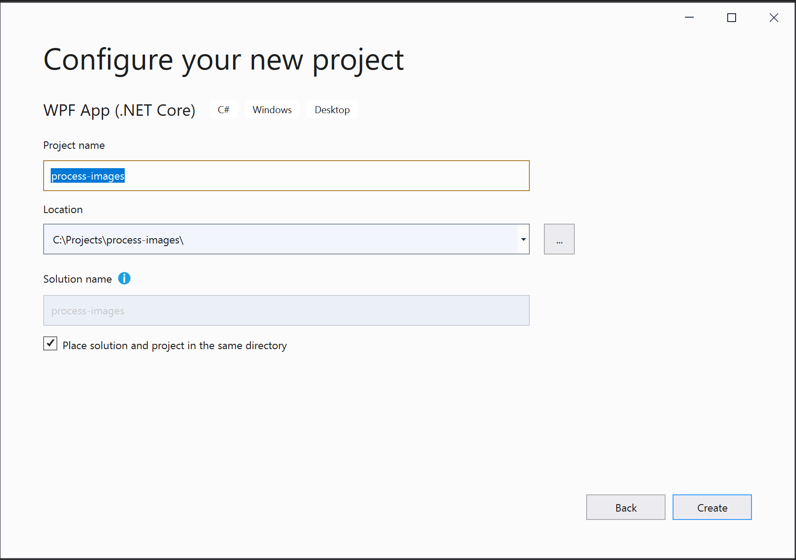
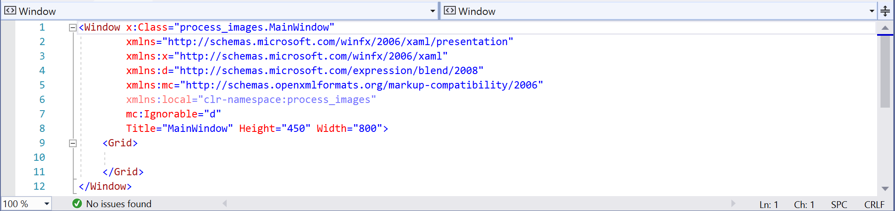

# An Annoying Bug in Visual Studio for .NET Core 3.x and .NET 5

Recently, I was working on a project migration from .NET Framework to .NET Core. Following certain guidelines and tools [1], everything moved rather smoothly. However, there was one issue which didn't seem to be obvious, but didn't work: some resources were not recognized and wouldn't build or wouldn't show up. One of things I tried was to change all the resource paths to absolute paths in the project to see what happened, well, it worked! This got me thinking that something in the process or the platform tool chain itself had issues. By more searching and digging, finally it was determined that the .NET Core build process was broken when you had resources which were not taken care of.
To demonstrate this problem, I installed both MSVS (Microsoft Visual Studio) Community 2019 Version 16.6.1 (to support .NET Core 3.0 and 3.1) [2] and MSVS Community 2019 Preview Version 16.7.0 Preview 2.0 (to support .NET 5.0) [3] to confirm this problem. They both showed the same issue. I hope that Microsoft can fix it soon as it's been a while.

## Here are the steps:
1. Open MSVS and select "Create a new project"
2. You'd need to search for "WPF App (.NET Core) C#" for your project template:

                       Fig. 1 Create WPF App on .NET Core3. 
3. Click on "Next", you'll be prompted for project folder and project name:

4. You can change them for your preferences, and click on "Create"
5. Your solution panel should look like the following:

6. Right-click on "process-images" project (Not the Solution, but the one under it!) and "Add"->"New Folder", give the folder name "Images"
7. Then Right-Click on "Images" folder just created to "Add"->"Existing Items …"
8. I added 3 icons from my file systems, you can add any image files you prefer, but it should look like the following:

9. Double click on the file "MainWindow.xaml", and you should see a white blank canvas popping up in the middle of the studio. Underneath, you should see the file content:

10. From "Toolbox" on the left panel, select "Image" and drag it to "MainWindow.xaml" blank canvas, repeat two more times (3 times in total). Your "MainWindow.xaml"file should now look like:

11. We can now connect our icons to the 3 image items just added by typing the following source info to the image items:
```
<Image Source="/Images/icon_1.png HorizontalAllignment="Left"... />
<Image Source="/Images/icon_2.png HorizontalAllignment="Left"... />
<Image Source="/Images/icon_3.png HorizontalAllignment="Left"... />
```
12. You should immediately see the 3 icons on the canvas:

13. Now, under "Build" menu, you can "Build Solution" or "Rebuild Solution" successfully without any error or warning.
14. But when you run it either "Start Debugging" or "Start Without Debugging" under "Debug" menu, the App pops up showing nothing on the white background! 
Where did my beautiful icons go?


The problem is that the image resources are not recognized in the build process such that the info is missing and our program has no idea how to pull them in. This bug is especially annoying because your build process doesn't give you any indication that something is terribly wrong and your final product is not what you designed!
To fix this bug, you just need to provide the resource info in your project file "process-images.csproj", the original one looks like the following:
```
<Project Sdk="Microsoft.NET.Sdk.WindowsDesktop">
<PropertyGroup>
    <OutputType>WinExe</OutputType>
    <TargetFramework>netcoreapp5.0</TargetFramework>
    <RootNamespace>process_images</RootNamespace>
    <UseWPF>true</UseWPF>
  </PropertyGroup>
</Project>
```
By adding resource info, it should look like this and fix your problem:
```
<Project Sdk="Microsoft.NET.Sdk.WindowsDesktop">
<PropertyGroup>
    <OutputType>WinExe</OutputType>
    <TargetFramework>netcoreapp5.0</TargetFramework>
    <RootNamespace>process_images</RootNamespace>
    <UseWPF>true</UseWPF>
  </PropertyGroup>
  <ItemGroup>
    <Resource Include="Images/*.png" />
  </ItemGroup>
</Project>
```
I hope that it helps if you are still having the similar issue.

## TIP:
1. When you design images on the canvas, don't worry too much on aligning them manually, you just want to drag them onto your canvas first and connect the image resources. After that you calculate exactly where you need them to be and type in the positions (Height, Margin and Width). 

2. After you change your project file, you need to save it and rebuild your project before debugging.

## References:
[1] https://docs.microsoft.com/en-us/dotnet/standard/analyzers/portability-analyzer

[2] https://visualstudio.microsoft.com/vs/

[3] https://visualstudio.microsoft.com/vs/preview/

[4] https://stackoverflow.com/questions/1192054/load-image-from-resources-area-of-project-in-c-sharp
